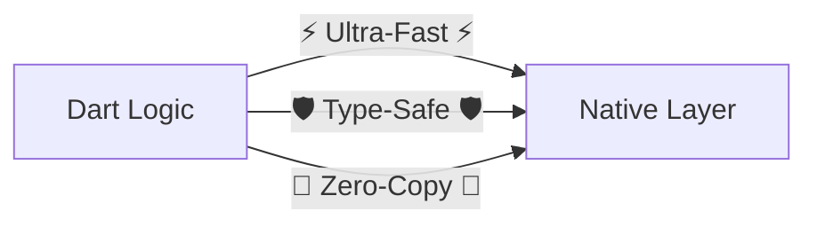
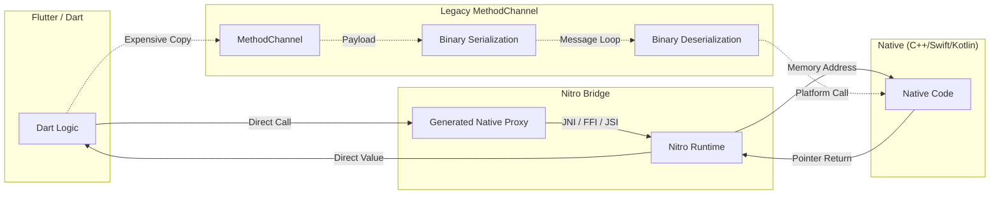

# Nitrogen — Zero-overhead FFI Plugins for Flutter

Write one `.native.dart` spec file. Get type-safe Kotlin, Swift, C++, and Dart FFI — all generated.

No method channels. No manual FFI. No boilerplate.

---

### ⚡ Current Status & Core Mission
Nitrogen bridges the gap between Flutter and Native with **Zero Overhead** and **Full Type-Safety**.



**✅ Currently Supporting**: Android (Kotlin) & iOS (Swift)
**🚀 Future Path**: Direct C/C++ generation for Raw FFI parity (~1µs).

---

## ✨ Developer Experience (DX)
Nitrogen is built to bring Flutter-like productivity to native development.

### 🛠️ Nitrogen CLI
At the heart of the ecosystem is **Nitrogen**, a TUI-powered CLI that eliminates manual boilerplate:
- **`nitrogen init`**: Scaffold a pre-wired plugin with optimized native configurations in seconds.
- **`nitrogen generate`**: Automatically produces all Dart FFI, Kotlin JNI, Swift bridges, and C++ implementations from your spec.
- **`nitrogen doctor`**: Run deep health diagnostics on your native build layers (`CMake`, `Podspec`, etc.) to catch wiring errors before they build.
- **`nitrogen link`**: Automatically wires native build files into your project with a single command.

---

## 🏗️ Architecture Flow
Nitrogen uses direct memory bindings and generated proxies to bypass serialization bottlenecks.



---

## 📊 Why Nitrogen?
Comparison of communication bridges on a modern device (OnePlus 11).

| Feature | Method Channel | Raw FFI (Dart → C/C++) | **Current Nitrogen** (Dart → Brdg → Kotlin/Swift) | **Future Nitrogen** (Dart → C/C++ w/ TypeSafe DX) |
|---|---|---|---|---|
| **Latency** | ~300µs | **~1µs** | **~7µs** | **~1µs** |
| **Architectural Flow** | Dart → Serialization → JNI → Native | Dart → Direct C Symbols | **Dart → C++ Bridge → Platform API** | **Dart → Direct C++ w/ Zero Overhead** |
| **DX / Boilerplate** | Moderate | Extreme (Manual) | **Minimal (Automated)** | **Minimal (Automated)** |
| **Type Safety** | Stringly-typed | None (Unsafe) | **High (Generated)** | **High (Generated)** |
| **Zero-Copy** | ❌ | ✅ | **✅ `@HybridStruct`** | **✅ `@HybridStruct`** |
| **Async / Stream** | ✅ (Slow) | Manual | **✅ Automated Bridges** | **✅ Automated Direct** |

---

## `@HybridRecord` wire format

`@HybridRecord` types cross the FFI boundary as a compact little-endian binary buffer (`uint8_t*`) rather than a JSON string. This avoids text serialization, intermediate `Map` allocations, and JSON parsing on both sides.

```
[4-byte payload length][fields in declaration order]

int      → 8 bytes, little-endian int64
double   → 8 bytes, little-endian float64
bool     → 1 byte  (0 = false, 1 = true)
String   → 4-byte UTF-8 length + UTF-8 bytes
nullable → 1-byte null tag (0 = null, 1 = present) + value if present
list     → 4-byte element count + elements back-to-back
nested record → fields written inline (no extra length prefix)
```

Native side receives a `ByteArray` (Kotlin) or `Data` (Swift) and reads fields in declaration order — no JSON parsing, no `HashMap` allocation, no GC pressure.

---

## Exception Handling

Nitrogen provides idiomatic error propagation from native code (Kotlin/Swift/C++) back to Dart.

- **Android**: Any unhandled Java exception in your `HybridObject` implementation is automatically caught by the JNI bridge and re-thrown as a `HybridException` in Dart.
- **iOS**: Swift errors and `NSException` instances are caught by the `@_cdecl` bridge and propagated to Dart.
- **C++**: Throwing `std::runtime_error` or using `NitroSetError` from the static C shim allows you to send custom error messages and codes.

```dart
try {
  await myModule.doWork();
} on HybridException catch (e) {
  print('Native error: ${e.message}'); // "Java.lang.RuntimeException: Device not found"
}
```

---

## Package overview

| Package | Version | Role | Add to |
|---|---|---|---|
| [`nitro`](packages/nitro/README.md) | [](https://pub.dev/packages/nitro) | Runtime dependency | plugin `dependencies:` |
| [`nitro_generator`](packages/nitro_generator/README.md) | [](https://pub.dev/packages/nitro_generator) | build_runner generator | plugin `dev_dependencies:` |
| [`nitrogen_cli`](packages/nitrogen_cli/README.md) | [](https://pub.dev/packages/nitrogen_cli) | CLI (`generate`, `init`, `link`, `doctor`) | `dart pub global activate` |
| [`nitro_annotations`](packages/nitro_annotations/README.md) | [](https://pub.dev/packages/nitro_annotations) | Annotations | plugin `dependencies:` |

---

## License

MIT
