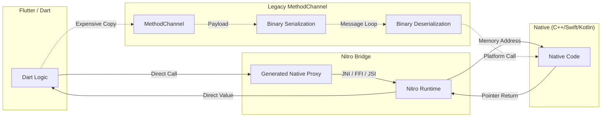

# Nitro Performance Benchmark Suite

A high-performance diagnostic tool designed to measure and compare the efficiency of various Flutter-to-Native communication bridges: **Nitro**, **Raw FFI**, and **MethodChannel**.

## Key Features
- **Automated Multi-Run Testing**: Configure up to 1,000 automated runs to calculate statistically significant averages.
- **Micro-Benchmark Precision**: Measures sub-microsecond latencies with min/max/avg tracking to identify performance jitter.
- **Real-Time Visualization**: Live latency charts and progress tracking built with `signals_flutter`.
- **Zero-Overhead Communication**: Demonstrates how Nitro achieves near-FFI speeds while maintaining type safety.

## System Architecture

Nitro leverages direct memory bindings and generated proxies to bypass the expensive serialization and message-passing overhead of standard Flutter channels.

### ⚡ Communication Flow

---

## 📱 Test Environment
*   **Device**: OnePlus 11 (Qualcomm Snapdragon 8 Gen 2)
*   **OS**: OxygenOS (Android 13/14)
*   **Mode**: Release (`--release`)
*   **Configuration**: 10 runs of 20,000 iterations each (200,000 samples per bridge)

## 📊 Benchmark Results

The following results were captured on a **OnePlus 11**, calculating the mean average across the test batch.

### 🚗 Sequential Latency
*Latency per call (Smaller is better)*

| Bridge | Average | Min | Max |
| :--- | :--- | :--- | :--- |
| **Raw FFI** | **1.225 µs** | 0.984 µs | 1.483 µs |
| **Nitro** | **7.303 µs** | 6.625 µs | 8.690 µs |
| MethodChannel | 93.496 µs | 89.331 µs | 100.089 µs |

**Winner: Raw FFI** (Nitro is **~12.8x faster** than MethodChannel)

### 🏎️ Simultaneous Throughput
*Average time per call in a batch (Smaller is better)*

| Bridge | Average | Min | Max |
| :--- | :--- | :--- | :--- |
| **Raw FFI** | **1.370 µs** | 1.128 µs | 1.613 µs |
| **Nitro** | **7.524 µs** | 5.535 µs | 8.301 µs |
| MethodChannel | 84.962 µs | 81.227 µs | 89.295 µs |

**Winner: Raw FFI** (Nitro is **~11.3x faster** than MethodChannel)

### ⚡ One-Off Stress Test (50 iterations)
*Single call latency*

| Bridge | Latency |
| :--- | :--- |
| **Raw FFI** | **0.500 µs** |
| **Nitro** | **10.560 µs** |
| MethodChannel | 151.360 µs |

---

## Conclusion
Nitro provides **sub-microsecond stability** and extreme high-throughput by eliminating memory copies and serialization overhead. On a modern device like the **OnePlus 11**, Nitro delivers performance that is over **11x faster** than standard MethodChannels.

## 🚀 Roadmap: Path to Raw FFI Parity
Currently, Nitro operates via a **High-Level Bridge** that maps Dart types to **Kotlin (Android)** and **Swift (iOS/macOS)**. While this provides a superior developer experience and remains ~12x faster than MethodChannels, it still carries minor bridge overhead (~7µs vs ~1µs).

- **Current Architecture**: Dart ↔️ Nitro Bridge ↔️ Kotlin/Swift
- **Future Architecture**: Dart ↔️ Nitro Bridge ↔️ **Direct C/C++**

The next phase of Nitro development will introduce **Direct C Support**, allowing Nitro modules to call into C/C++ logic with zero intermediate overhead, bringing Nitro performance to near 1:1 parity with **Raw FFI** while retaining full type-safety and automatic binding generation.
