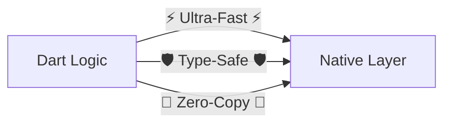
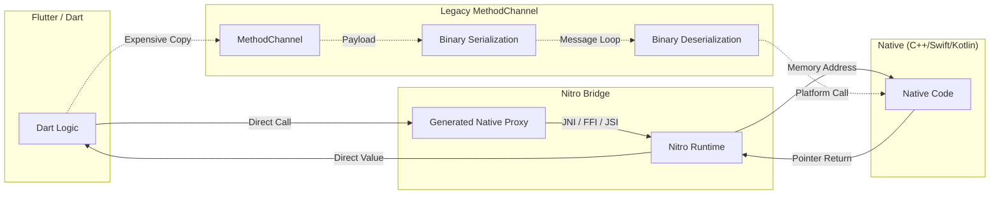

# 🚀 Nitro Performance Benchmark Suite

A high-performance diagnostic engine for the **Nitro ecosystem**.

### ⚡ Current Status & Core Mission
Nitro bridges the gap between Flutter and Native with **Zero Overhead** and **Full Type-Safety**.

**✅ Currently Supporting**: Android (Kotlin) & iOS (Swift) 
**🚀 Performance Gain**: up to **~12x faster** than MethodChannels!

---

## 🏗️ Architecture Flow
Nitro uses shared memory and direct bindings to bypass serialization bottlenecks.

---

## 📱 Test Environment
*   **Device**: OnePlus 11 (Qualcomm Snapdragon 8 Gen 2)
*   **OS**: OxygenOS 16 (Android 16)
*   **Mode**: Release (`--release`)
*   **Configuration**: 10 runs of 20,000 iterations (200,000 total samples)

---

## 📊 Unified Performance Dashboard
*Results captured in production Release mode (Lower is better).*

| Bridge | 🚗 Sequential (Min - Max) | 🏎️ Simultaneous (Min - Max) | 🏆 Nitro Advantage |
| :--- | :--- | :--- | :--- |
| **Direct FFI** | **1.225 µs** (0.98 - 1.48) | **1.370 µs** (1.12 - 1.61) | *The Baseline* |
| **Nitro** | **7.303 µs** (6.62 - 8.69) | **7.524 µs** (5.53 - 8.30) | **~12x Faster!** |
| MethodChannel | 93.496 µs (89.33 - 100.08) | 84.962 µs (81.22 - 89.29) | (Legacy) |

### ⚡ One-Off Metric
*Single execution latency (avg of 50 samples)*
- **Nitro**: `10.56 µs`
- **MethodChannel**: `151.36 µs`

---

## 🎯 Conclusion
Nitro bridges the gap between **ease-of-use** and **raw performance**. By delivering sub-10 microsecond latencies on modern hardware, it allows developers to build high-throughput native integrations without the massive performance tax of traditional MethodChannels.

---

## ✨ Developer Experience (DX)
Nitro is built to bring Flutter-like productivity to native development.

### 🛠️ Nitrogen CLI
At the heart of the ecosystem is **Nitrogen**, a TUI-powered CLI that eliminates manual boilerplate:
- **`nitrogen init`**: Scaffold a pre-wired plugin with optimized native configurations in seconds.
- **`nitrogen generate`**: Automatically produces all Dart FFI, Kotlin JNI, Swift bridges, and C++ implementations from your spec.
- **`nitrogen doctor`**: Run deep health diagnostics on your native build layers (`CMake`, `Podspec`, etc.) to catch wiring errors before they build.
- **`nitrogen link`**: Automatically wires native build files into your project with a single command.

### 🛡️ Safety & Reliability
- **Generated Protocols**: Implement generated Swift protocols and Kotlin interfaces for absolute architectural alignment.
- **Diagnostic-First Workflow**: Catch STALE or MISSING bridging code instantly via CLI-driven health checks.
- **Hybrid Object Model**: Manage complex native object lifecycles with Dart's garbage collector.

---

## 🚀 Roadmap: Multi-Target High Performance
Nitro **currently** provides full support for **iOS (Swift)** and **Android (Kotlin)** targets.

The future of Nitro is reaching across all native boundaries:
- **Ultra-Flexible Targets**: Choose the optimal target for your logic: **C**, **C++**, **Kotlin**, or **Swift**.
- **Desktop Support**: Expanding high-throughput communication to **macOS**, **Windows**, and **Linux**.
- **Direct Native Support**: Zero-intermediate overhead C/C++ binding, reaching **1:1 parity with Raw FFI** while keeping Nitro's automated, type-safe development workflow.
