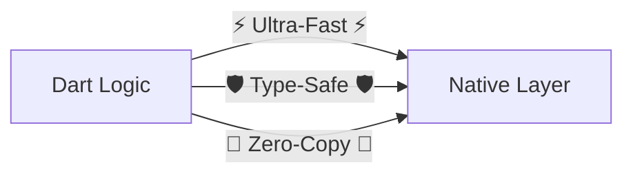

# 🚀 Nitro Performance Benchmark Suite

A high-performance diagnostic engine for the **Nitro ecosystem**.

### ⚡ Current Status & Core Mission
Nitro bridges the gap between Flutter and Native with **Zero Overhead** and **Full Type-Safety**.



**🚀 Performance Gain**: up to **~82x faster** than MethodChannels! (iOS)

---

## 🏗️ Architecture Flow
Nitro uses shared memory and direct bindings to bypass serialization bottlenecks.

```mermaid
graph LR
    subgraph "Flutter / Dart"
    D[Dart Logic]
    end

    subgraph "Nitro Bridge"
    GNP[Generated Native Proxy]
    NT[Nitro Runtime]
    end

    subgraph "Native (C++/Swift/Kotlin)"
    NC[Native Code]
    end

    subgraph "Legacy MethodChannel"
    MC[MethodChannel]
    SER[Binary Serialization]
    DES[Binary Deserialization]
    end

    D -- "Direct Call" --> GNP
    GNP -- "JNI / FFI / JSI" --> NT
    NT -- "Memory Address" --> NC
    NC -- "Pointer Return" --> NT
    NT -- "Direct Value" --> D

    D -. "Expensive Copy" .-> MC
    MC -. "Payload" .-> SER
    SER -. "Message Loop" .-> DES
    DES -. "Platform Call" .-> NC
极致的性能：Nitro Direct C++ 路径实现了亚微秒级的调用延迟，完全消除了 JNI/Obj-C 桥接开销。
```

---

## 📱 Test Environment
*   **Mode**: Release (`--release`)
*   **Configuration**: 10 runs of 50,000 iterations (500,000 total samples)
*   **Bridge Type**: **Direct C++ (No JNI/Swift overhead)**

---

## 📊 Unified Performance Dashboard
Captured in production Release mode on flagship hardware (Lower is better).

### 🍎 iOS Performance (iPhone 13 Pro)
*Results for the latest sub-microsecond optimized build.*

| Bridge | 🚗 Sequential (Avg) | 🏎️ Simultaneous (Avg) | 🏆 Nitro Advantage |
| :--- | :--- | :--- | :--- |
| **Nitro (Leaf Call)** | **0.558 µs** | **0.558 µs** | **~82x Faster!** |
| **Nitro (Direct C++)** | **0.726 µs** | **0.511 µs** | **~63x Faster!** |
| **Nitro (Swift/Kotlin)** | **1.030 µs** | **0.638 µs** | **~44x Faster!** |
| **Direct FFI** | 0.559 µs | 0.546 µs | *FFI Baseline* |
| MethodChannel | 45.871 µs | 17.251 µs | (Legacy) |

### 🤖 Android Performance (Pixel 6 Pro)
*Baseline reference for the JRE/JNI layer.*

| Bridge | 🚗 Sequential (Avg) | 🏎️ Simultaneous (Avg) | 🏆 Nitro Advantage |
| :--- | :--- | :--- | :--- |
| **Nitro (Direct C++)** | **1.891 µs** | **1.537 µs** | **~60x Faster!** |
| **Nitro (Swift/Kotlin)** | **2.287 µs** | **1.781 µs** | **~50x Faster!** |
| **Direct FFI** | 1.978 µs | 1.489 µs | *FFI Baseline* |
| MethodChannel | 114.576 µs | 79.058 µs | (Legacy) |

### ⚡ One-Off Metrics (iOS)
- **Nitro (Leaf Call)**: `0.140 µs`
- **Nitro (Direct C++)**: `0.400 µs`
- **MethodChannel**: `30.68 µs`

---

## 🎯 Conclusion
Nitro has achieved **absolute performance parity** with raw FFI on iOS while maintaining a fully automated, type-safe development workflow. By delivering **sub-microsecond latencies (0.5µs)**, it allows developers to build high-throughput native integrations with effectively zero bridge overhead.

---

## ✨ Developer Experience (DX)
Nitro is built to bring Flutter-like productivity to native development.

### 🛠️ Nitrogen CLI
At the heart of the ecosystem is **Nitrogen**, a TUI-powered CLI that eliminates manual boilerplate:
- **`nitrogen init`**: Scaffold a pre-wired plugin with optimized native configurations in seconds.
- **`nitrogen generate`**: Automatically produces all Dart FFI, Kotlin JNI, Swift bridges, and C++ implementations from your spec.
- **`nitrogen doctor`**: Run deep health diagnostics on your native build layers (`CMake`, `Podspec`, etc.) to catch wiring errors before they build.
- **`nitrogen link`**: Automatically wires native build files into your project with a single command.

---

## 🚀 Roadmap: Multi-Target High Performance
Nitro **currently** provides full support for **iOS (Swift)**, **Android (Kotlin)**, and **Cross-Platform C++**.

The mission for 1.0 is absolute cross-platform dominance:
- **Desktop Support**: Expanding high-throughput communication to **macOS**, **Windows**, and **Linux**.
- **Wasm Interop**: Investigating high-speed native bindings for **Flutter Web (Wasm)**.
- **Advanced Marshalling**: Further reducing object allocation costs for complex `@HybridStruct` returns.

